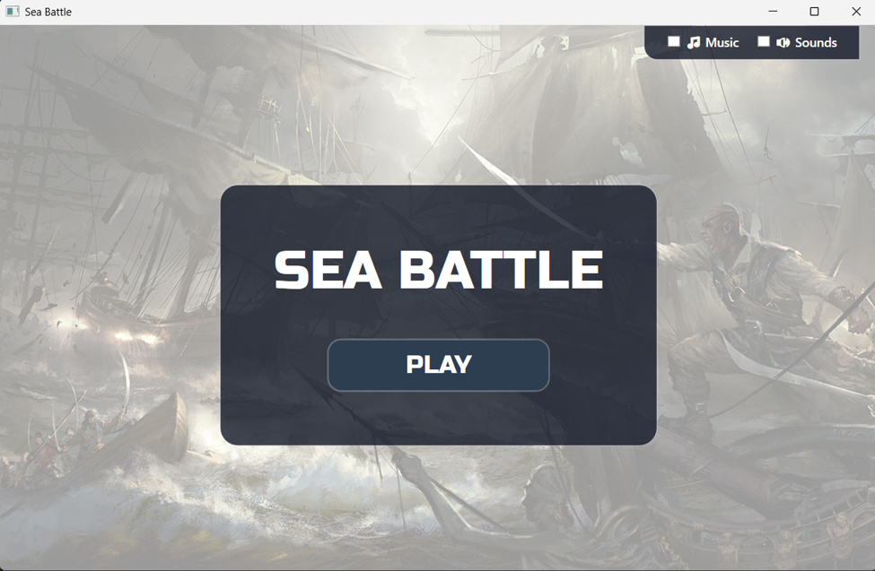
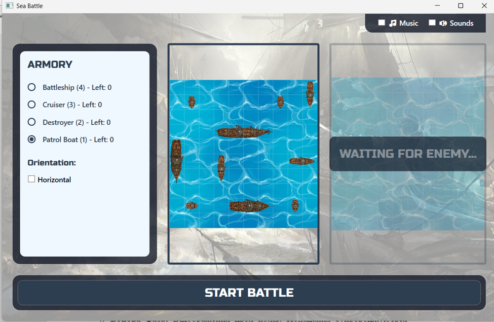
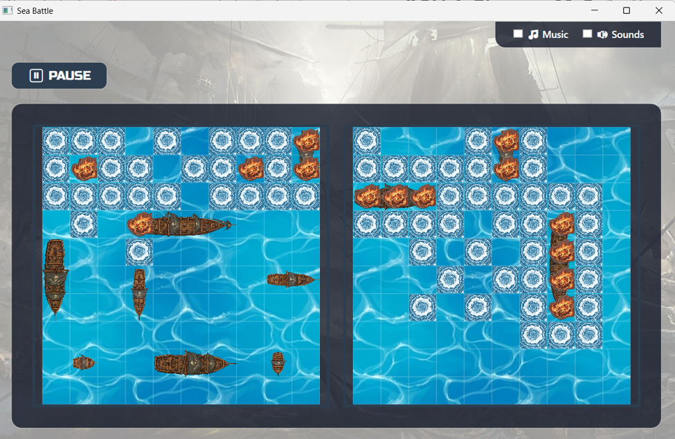

# ⚓ Sea Battle (Battleship) - WPF Game

A modern, feature-rich implementation of the classic "Sea Battle" (Battleship) board game, built with **C#** and **WPF**.

This project was developed as a first-year university coursework assignment (Information Systems and Technologies). It goes beyond basic requirements by focusing on industry-standard clean architecture, smart AI behavior, and a highly polished, immersive user interface.

## ✨ Key Features

- **🧠 Smart AI Opponent:** The bot uses an advanced targeting algorithm. Once it scores a hit, it mathematically calculates the ship's axis (horizontal or vertical) and intelligently targets the remaining decks, rather than shooting randomly.
- **🎨 Modern UI/UX:** Features a custom "Glassmorphism" design, epic fire/water visual decals, and smooth dynamic UI updates without frame drops.
- **🔊 Audio Feedback:** Integrated background music and conditional sound effects for shooting, hitting, missing, and sinking ships.
- **⚡ Highly Optimized:** Implements the **Flyweight pattern** for image caching and optimized data binding to ensure smooth performance without memory leaks or UI-thread freezing.

## 🏗️ Architecture & Tech Stack

- **Language:** C#
- **Framework:** WPF (.NET)
- **Design Pattern:** Strict **MVVM** (Model-View-ViewModel)
  - Complete separation of UI logic (Views) and game business rules (ViewModels).
  - Implemented **Dependency Injection** via custom `INavigationService` for seamless View switching.
  - Defensive programming techniques and robust `INotifyPropertyChanged` implementations for stable data binding.

## 📸 Screenshots

<p align="center">
  
  
  
</p>

## 🚀 How to Run

1. Clone the repository:
   ```bash
   git clone [https://github.com/your-username/SeaBattle_Coursework.git](https://github.com/your-username/SeaBattle_Coursework.git)
   ```
